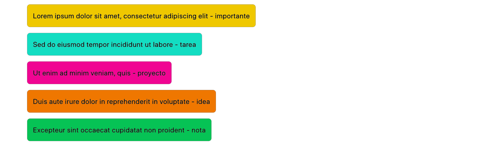

# post-it

## Description

Template CSS for html block with style like post-it.

- classes are last word of post's text(in spanish):
importante, tarea, proyecto, idea or nota

## Web Preview

- [demo online](https://patricio-dsgn.github.io/post-it/)

## Image preview

