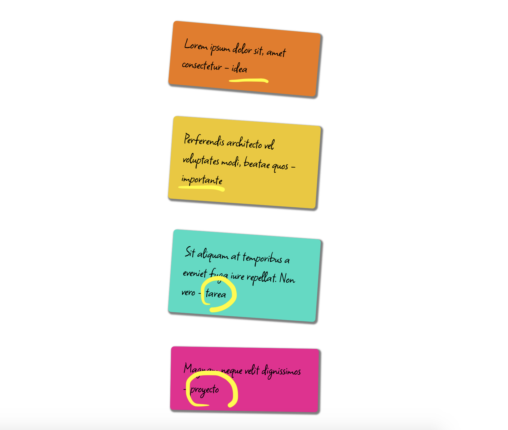

# post-it

## Description

Template CSS for html block with style like post-it.

- classes are last word of post's text(in spanish):
importante, tarea, proyecto, idea or nota

Lorem ipsum dolor sit amet, consectetur adipiscing elit - importante

Sed do eiusmod tempor incididunt ut labore - tarea

Ut enim ad minim veniam, quis - proyecto

Duis aute irure dolor in reprehenderit in voluptate - idea

Excepteur sint occaecat cupidatat non proident - nota

## Web Preview

- [demo online](https://patricio-dsgn.github.io/post-it/)

## Image preview

